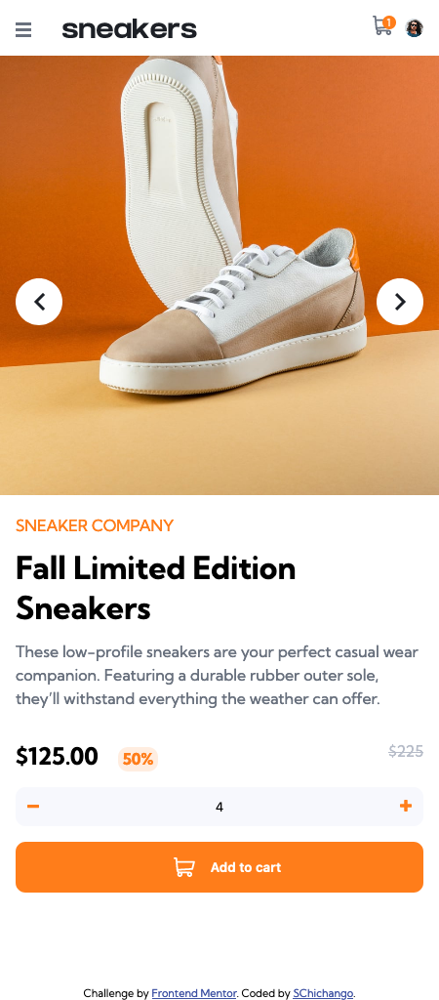
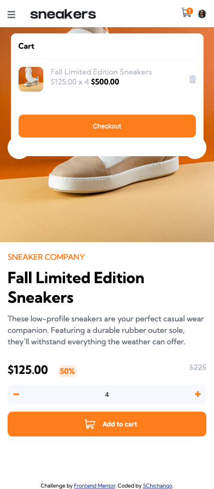
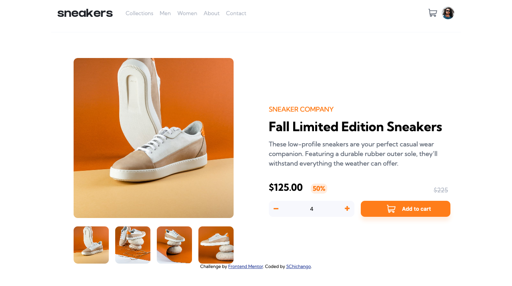
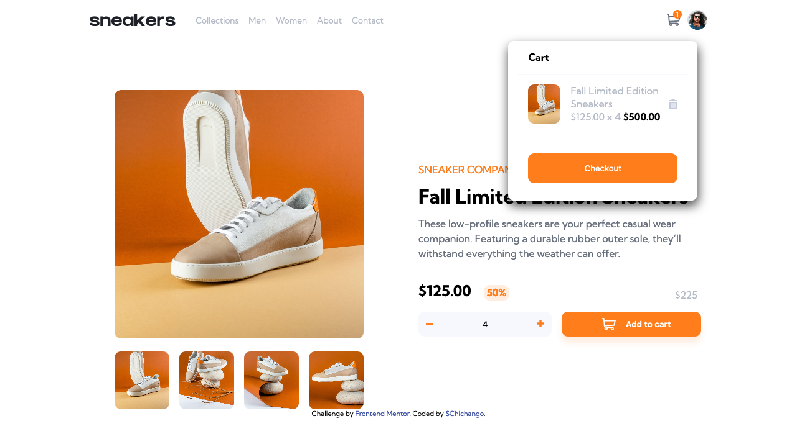
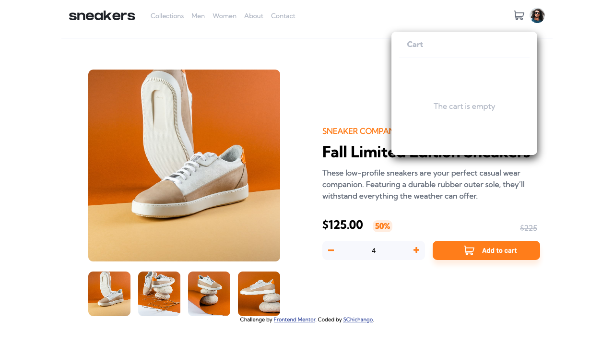

<!-- @format -->

# Frontend Mentor - E-commerce product page solution

This is a solution to the [E-commerce product page challenge on Frontend Mentor](https://www.frontendmentor.io/challenges/ecommerce-product-page-UPsZ9MJp6). Frontend Mentor challenges help you improve your coding skills by building realistic projects.

## Table of contents

- [Overview](#overview)
  - [The challenge](#the-challenge)
  - [Screenshot](#screenshot)
  - [Links](#links)
- [My process](#my-process)
  - [Built with](#built-with)
  - [Continued development](#continued-development)
  - [Useful resources](#useful-resources)
- [Author](#author)

## Overview

### The challenge

Users should be able to:

- View the optimal layout for the site depending on their device's screen size
- See hover states for all interactive elements on the page
- Open a lightbox gallery by clicking on the large product image
- Switch the large product image by clicking on the small thumbnail images
- Add items to the cart
- View the cart and remove items from it

### Screenshot

### Links

- Solution URL: [Add solution URL here](https://your-solution-url.com)
- Live Site URL: [Add live site URL here](https://your-live-site-url.com)

## My process

### Built with

- Semantic HTML5 markup
- CSS custom properties
- Flexbox
- Mobile-first workflow
  -JavaScript

### Continued development

I want to focus more on Javascript, especially DOM manipulation. It was the area which took me the majority of the time to get it how I wanted it to be, and even after finnishing the project I feel like the code could've actually been less than what I wrote.

### Useful resources

- [Image Slider](https://www.w3schools.com/howto/howto_js_slideshow.asp) - This helped me make the image slider for the page. It was a simple tutorial and I could implement it right away in my project
- [Flexbox](https://css-tricks.com/snippets/css/a-guide-to-flexbox/) - This is an amazing article which helped me better understand flexbox and how I could use it to make my layout's appearence much closer to the images.

## Author

- Frontend Mentor - [@SChichango](https://www.frontendmentor.io/profile/SChichango)
- Twitter - [@itsLxo](https://www.twitter.com/itsLxo)
